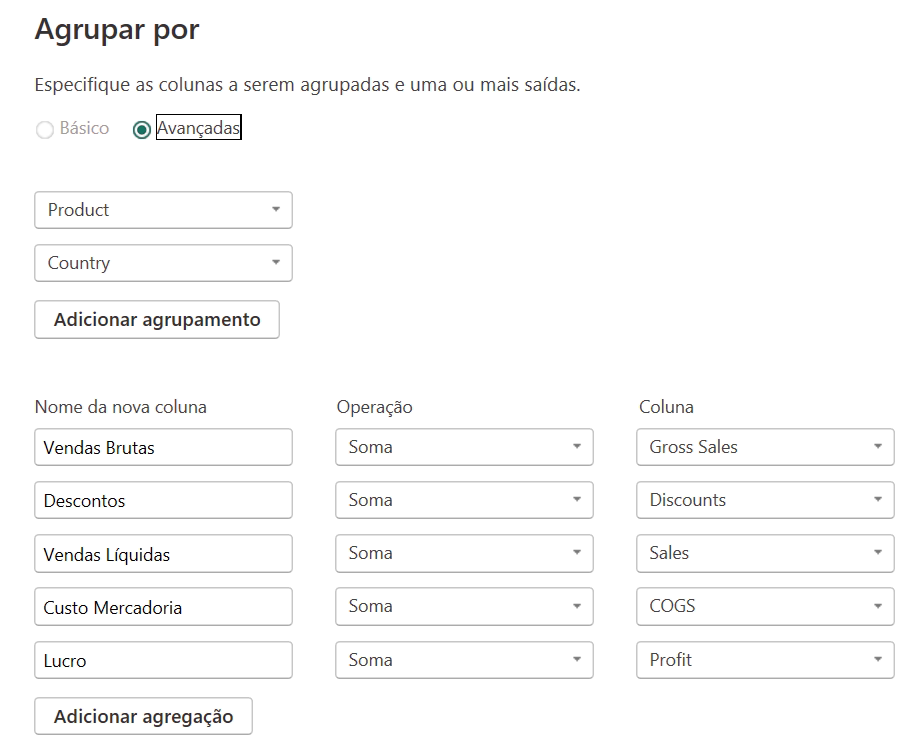
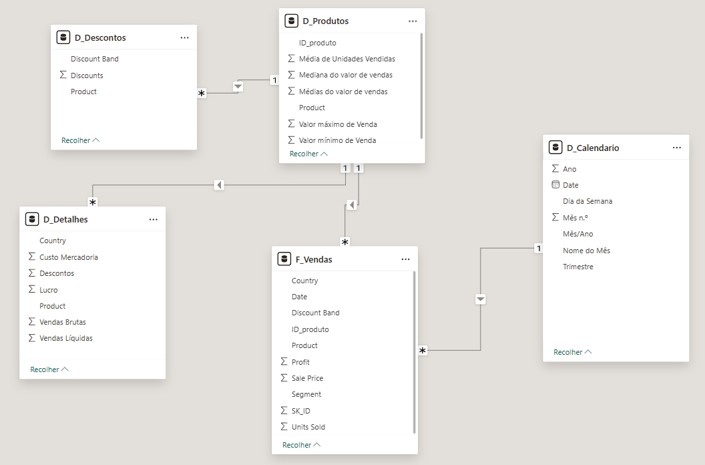

# Modelagem de Vendas Corporativas com Power BI - Star Schema

## 📌 Descrição do Projeto
Este repositório contém o desenvolvimento do desafio de modelagem de dados proposto no Bootcamp NTT DATA - Engenharia de Dados com Python. O projeto consiste em processar uma base de dados financeira bruta (`financial_sample.xlsx`) e estruturá-la seguindo as melhores práticas de Business Intelligence, utilizando o modelo **Star Schema** (Esquema Estrela).

O foco principal é a transição de uma tabela única (flat file) para um modelo multidimensional, visando otimizar a performance do dashboard e facilitar a criação de cálculos complexos via DAX.

## 📊 Especificação dos Dados Originais
A tabela abaixo descreve a estrutura da fonte de dados utilizada antes do processo de modelagem:

| Nome da Coluna | Tipo de Dado (Power BI) | Descrição do Conteúdo |
| :--- | :--- | :--- |
| **Segment** | Texto (String) | Segmento de mercado do cliente. |
| **Country** | Texto (String) | País onde a venda foi realizada. |
| **Product** | Texto (String) | Nome do produto vendido. |
| **Discount Band** | Texto (String) | Categoria do nível de desconto (None, Low, Medium, High). |
| **Units Sold** | Número Decimal (Float) | Quantidade de itens vendidos. |
| **Manufacturing Price** | Número Decimal / Moeda | Custo de fabricação por unidade. |
| **Sale Price** | Número Decimal / Moeda | Preço de venda unitário de tabela. |
| **Gross Sales** | Número Decimal / Moeda | Valor total bruto (Unidades x Preço de Venda). |
| **Discounts** | Número Decimal / Moeda | Valor total do desconto aplicado à venda. |
| **Sales** | Número Decimal / Moeda | Valor líquido das vendas (Gross Sales - Discounts). |
| **COGS** | Número Decimal / Moeda | Custo das Mercadorias Vendidas (Unidades x Custo Fab.). |
| **Profit** | Número Decimal / Moeda | Lucro líquido (Sales - COGS). |
| **Date** | Data (Date) | Data completa da transação. |
| **Month Number** | Número Inteiro (Integer) | Representação numérica do mês (1 a 12). |
| **Month Name** | Texto (String) | Nome do mês por extenso. |
| **Year** | Número Inteiro (Integer) | Ano da transação. |

## 🛠️ Etapas do Projeto
1. **Limpeza e Transformação:** Processamento dos dados no Power Query para garantir a integridade das informações.
2. **Modelagem Multidimensional:** 
- Criação da tabela **Fato** (`f_Vendas`).
- Criação das tabelas de **Dimensão** (`d_Produtos`, `d_Calendario`, `d_Segmentos`, `d_Localidade`).
3. **Criação de Medidas DAX:** 
- Desenvolvimento de KPIs essenciais como Total de Vendas, Lucro Total e métricas comparativas de tempo.
4. **Visualização:** Construção de um Dashboard interativo com filtros e visuais que facilitam a tomada de decisão.

## Relatório de Execução: Modelagem Dimensional Star Schema

### 1. Processo de ETL e Transformação (Power Query)

#### Governança da Fonte

- Seguindo o roteiro do desafio, as tabelas foram criadas a partir de referências à tabela original para garantir a linhagem dos dados.
- A tabela original foi preservada como `Financials_origem`.
- **Configuração:** A carga desta tabela foi desabilitada para otimizar o consumo de memória do motor VertiPaq.

### Criação das Tabelas de Dimensão (D_)

- Financials_origem (modo oculto – backup)
- D_Produtos (ID_produto, Produto, Média de Unidades Vendidas, Médias do valor de vendas, Mediana do valor de vendas, Valor máximo de Venda, Valor mínimo de Venda)
- D_Produtos_Detalhes(ID_produtos, Discount Band, Sale Price,  Units Sold, Manufactoring Price)
- D_Descontos (ID_produto, Discount, Discount Band)
- D_Detalhes (Products, Country, Vendas_Brutas, Descontos, Vendas Líquidas, Custo_Mercadoria, Lucro)
- D_Calendário – Criada por DAX com calendar()
- F_Vendas (SK_ID , ID_Produto, Produto, Units Sold, Sales Price, Discount  Band, Segment, Country, Salers, Profit, Date (campos))

Detalhes dos agrupamentos da tabela **D_Detalhes**:

<p align="center">
  
</p>

## 3. Modelagem de Dados e DAX

### Inteligência de Tempo
A tabela **D_Calendário** foi criada do zero utilizando DAX para permitir filtros temporais dinâmicos e comparativos de período (Time Intelligence).

```DAX
D_Calendario = 
VAR DataMinima = MIN(F_Vendas[Date])
VAR DataMaxima = MAX(F_Vendas[Date])
RETURN
ADDCOLUMNS (
    CALENDAR(DataMinima, DataMaxima),
    "Ano", YEAR([Date]),
    "Mês n.º", MONTH([Date]),
    "Nome do Mês", FORMAT([Date], "MMMM"),
    "Trimestre", "T" & QUARTER([Date]),
    "Dia da Semana", FORMAT([Date], "DDDD"),
    "Mês/Ano", FORMAT([Date], "MMM/YYYY")
)
```

### Arquitetura Star Schema
No ambiente de modelagem, as relações foram configuradas com cardinalidade **1:N (Um para Muitos)** e direção de filtro único, onde as dimensões filtram a fato.

| Tabela | Função | Chave de Ligação |
| :--- | :--- | :--- |
| **f_Vendas** | Fato | SK_ID (PK) |
| **d_Produtos** | Dimensão | ID_produto |
| **d_Calendário** | Dimensão | Date |
| **d_Descontos** | Dimensão | Discount Band / Product |

<p align="center">
  
</p>

## 🚀 Como Visualizar
1. Clone este repositório.
2. Certifique-se de ter o **Power BI Desktop** instalado.
3. Abra o arquivo `.pbix` (disponível na pasta principal) para explorar o modelo e os visuais.

---
Desenvolvido por [Arthur Haerdy Junior](https://github.com/ahaerdy).