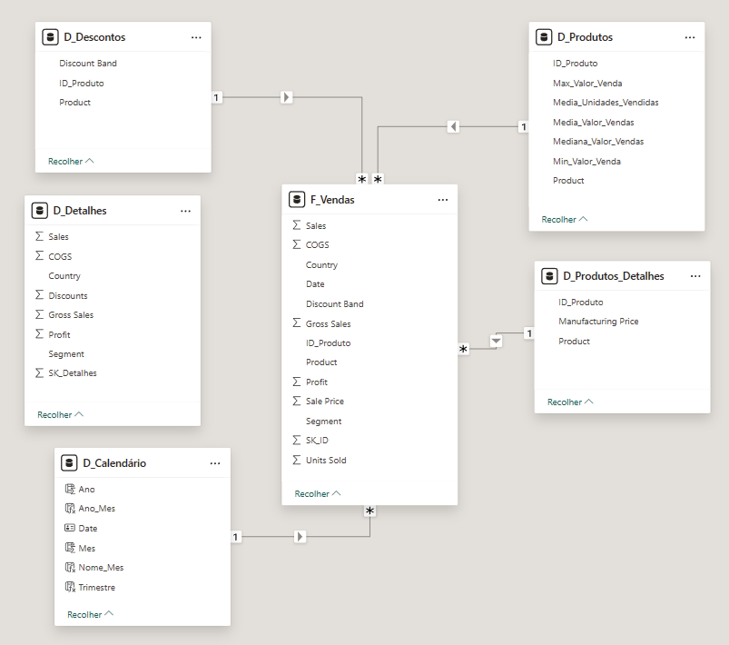

# 🌟 Modelagem e Transformação de Dados com DAX no Power BI
### Star Schema com Financial Sample

**Autor:** Arthur Haerdy Jr  
**Repositório:** [dio-powerbi-financials-star_schema](https://github.com/ahaerdy/dio-powerbi-financials-star_schema)  
**Bootcamp:** NTT Data — Engenharia de Dados com Python  
**Instrutora:** Juliana Mascarenhas (Tech Education Specialist / Cientista de Dados)

---

## 📋 Descrição do Projeto

O objetivo deste projeto é transformar uma tabela plana única — a **Financial Sample** — em um modelo de dados relacional otimizado no formato **Star Schema (Esquema Estrela)**, utilizando Power Query para as transformações e DAX para a criação da tabela de calendário.

---

## 📊 Sobre a Fonte de Dados — Financial Sample

A tabela original `financial_sample.xlsx` possui **700 linhas** e **16 colunas**, cobrindo o período de **setembro/2013 a dezembro/2014**.

| Coluna | Tipo | Descrição |
|---|---|---|
| Segment | Texto | Segmento de mercado (Government, Midmarket, Channel Partners, Enterprise, Small Business) |
| Country | Texto | País (Canada, Germany, France, Mexico, USA) |
| Product | Texto | 6 produtos: Carretera, Montana, Paseo, Velo, VTT, Amarilla |
| Discount Band | Texto | Faixa de desconto: None, Low, Medium, High |
| Units Sold | Decimal | Quantidade de unidades vendidas |
| Manufacturing Price | Inteiro | Preço de fabricação do produto |
| Sale Price | Inteiro | Preço de venda praticado |
| Gross Sales | Decimal | Vendas brutas |
| Discounts | Decimal | Valor do desconto aplicado |
| Sales | Decimal | Vendas líquidas |
| COGS | Decimal | Custo dos produtos vendidos |
| Profit | Decimal | Lucro da transação |
| Date | Data | Data da transação |
| Month Number | Inteiro | Número do mês |
| Month Name | Texto | Nome do mês |
| Year | Inteiro | Ano (2013 ou 2014) |

---

## 🗂️ Tabelas Criadas

### Financials_origem
Cópia oculta da tabela original usada como backup. Criada por duplicação da query `Financials` no Power Query, com carregamento desativado.

---

### D_Produtos
Tabela dimensão criada por **agrupamento** da tabela original pelo campo `Product`, consolidando estatísticas de vendas por produto.

| Coluna | Descrição |
|---|---|
| ID_Produto | Chave primária (coluna condicional) |
| Product | Nome do produto |
| Media_Unidades_Vendidas | Média de unidades vendidas |
| Media_Valor_Vendas | Média do valor de vendas |
| Mediana_Valor_Vendas | Mediana do valor de vendas |
| Max_Valor_Venda | Valor máximo de venda |
| Min_Valor_Venda | Valor mínimo de venda |

---

### D_Produtos_Detalhes
Tabela dimensão com informações cadastrais fixas dos produtos, com uma linha por produto.

| Coluna | Descrição |
|---|---|
| ID_Produto | Chave estrangeira para D_Produtos |
| Product | Nome do produto |
| Manufacturing Price | Preço de fabricação |

> Campos transacionais como `Sale Price` e `Units Sold` foram removidos pois variam por transação e pertencem à tabela fato.

---

### D_Descontos
Tabela dimensão com as faixas de desconto disponíveis por produto.

| Coluna | Descrição |
|---|---|
| ID_Produto | Chave estrangeira para D_Produtos |
| Product | Nome do produto |
| Discount Band | Faixa de desconto (None, Low, Medium, High) |

---

### D_Detalhes
Tabela dimensão com informações contextuais de vendas que não foram contempladas nas demais dimensões.

| Coluna | Descrição |
|---|---|
| SK_Detalhes | Chave substituta |
| Segment | Segmento de mercado |
| Country | País |
| Sales | Vendas líquidas |
| COGS | Custo dos produtos vendidos |
| Profit | Lucro |
| Gross Sales | Vendas brutas |
| Discounts | Valor do desconto |

---

### D_Calendário
Tabela de datas criada via **DAX** com a função `CALENDAR()`, cobrindo todo o período dos dados. Marcada como **Tabela de Data** no modelo para habilitar funções de inteligência de tempo.

```dax
D_Calendário = CALENDAR(DATE(2013, 1, 1), DATE(2014, 12, 31))
```

Colunas calculadas adicionadas:

```dax
Ano = YEAR(D_Calendário[Date])
Mes = MONTH(D_Calendário[Date])
Nome_Mes = FORMAT(D_Calendário[Date], "MMMM")
Trimestre = "T" & QUARTER(D_Calendário[Date])
Ano_Mes = FORMAT(D_Calendário[Date], "YYYY-MM")
```

---

### F_Vendas (Tabela Fato)
Tabela central do Star Schema, contendo todas as transações com suas métricas e chaves de relacionamento.

| Coluna | Descrição |
|---|---|
| SK_ID | Chave substituta da transação (índice) |
| ID_Produto | Chave estrangeira para as dimensões de produto |
| Product | Nome do produto |
| Units Sold | Unidades vendidas |
| Sale Price | Preço de venda |
| Discount Band | Faixa de desconto |
| Segment | Segmento de mercado |
| Country | País |
| Profit | Lucro |
| Gross Sales | Vendas brutas |
| Sales | Vendas líquidas |
| COGS | Custo dos produtos vendidos |
| Date | Data da transação (chave para D_Calendário) |

---

## 🎯 Papel Central da F_Vendas no Star Schema

A **F_Vendas é a tabela fato** — o coração do modelo. Enquanto as tabelas dimensão descrevem **o quê** (produtos, datas, descontos, segmentos), a F_Vendas registra **o que aconteceu**: cada transação de venda realizada.

Cada uma de suas 700 linhas representa uma transação única — uma venda de um produto específico, em um país, segmento e data determinados.

Suas colunas se dividem em dois tipos:

**Chaves — ligam a F_Vendas às dimensões:**
- `SK_ID` — identifica unicamente cada transação
- `ID_Produto` — conecta a D_Produtos, D_Produtos_Detalhes e D_Descontos
- `Date` — conecta a D_Calendário
- `Discount Band` — conecta a D_Descontos

**Métricas — os números que serão analisados:**
- `Units Sold`, `Sale Price`, `Gross Sales`, `Sales`, `COGS`, `Profit`

As tabelas dimensão **filtram e classificam**; a F_Vendas **responde às perguntas**. Por exemplo:
- *"Qual o lucro total por país em 2014?"* → Power BI filtra pela D_Calendário (2014) e soma `Profit` da F_Vendas
- *"Quantas unidades do Paseo foram vendidas com desconto Low?"* → filtra por D_Produtos e D_Descontos, soma `Units Sold` da F_Vendas

Sem a F_Vendas, as dimensões seriam apenas cadastros isolados sem nada para medir.


---

## ⚙️ Etapas e Funcionalidades Utilizadas

### Power Query
- **Referência de query** — para criar tabelas derivadas sem duplicar dados
- **Duplicação de query** — para criar o backup Financials_origem
- **Remover outras colunas** — para selecionar apenas os campos de cada dimensão
- **Remover duplicatas** — para garantir unicidade nas tabelas dimensão
- **Agrupar por** — para criar métricas estatísticas na D_Produtos
- **Coluna condicional** — para gerar o ID_Produto com base no nome do produto
- **Coluna de índice** — para gerar chaves substitutas (SK_ID, SK_Detalhes)
- **Reordenar colunas** — para organizar os campos de cada tabela
- **Ativar/desativar carregamento** — para ocultar a tabela de backup do modelo

### DAX
- `CALENDAR()` — para gerar a tabela de datas
- `DATE()` — para definir o intervalo do calendário
- `YEAR()`, `MONTH()`, `QUARTER()` — para extrair partes da data
- `FORMAT()` — para formatar datas como texto (nome do mês, ano-mês)

---

## 🌟 Star Schema — Diagrama do Modelo

### Relacionamentos

| Tabela Fato | Coluna | Tabela Dimensão | Coluna | Cardinalidade |
|---|---|---|---|---|
| F_Vendas | ID_Produto | D_Produtos | ID_Produto | *:1 |
| F_Vendas | ID_Produto | D_Produtos_Detalhes | ID_Produto | *:1 |
| F_Vendas | Discount Band | D_Descontos | Discount Band | *:1 |
| F_Vendas | Date | D_Calendário | Date | *:1 |

<p align="center">
  
</p>

---

## 🛠️ Tecnologias Utilizadas

- **Power BI Desktop**
- **Power Query (M)**
- **DAX (Data Analysis Expressions)**
- **Excel (.xlsx) — fonte de dados**

---

## 📁 Arquivos do Repositório

```
├── financial_sample.xlsx                    # Fonte de dados original
├── dio-power_bi-financials-star_schema.pbix # Arquivo Power BI com o modelo completo
└── README.md                                # Este arquivo
```

---

## Referências

- [Microsoft — Documentação Power BI](https://learn.microsoft.com/pt-br/power-bi/)
- [Microsoft — Referência DAX](https://learn.microsoft.com/pt-br/dax/)
- [Repositório de Estudos – Bootcamp NTT DATA - Engenharia de Dados com Python](https://github.com/ahaerdy/DIO-learning/tree/main/NTT%20DATA-Engenharia%20de%20Dados%20com%20Python#-reposit%C3%B3rio-de-estudos--bootcamp-ntt-data-engenharia-de-dados-com-python)